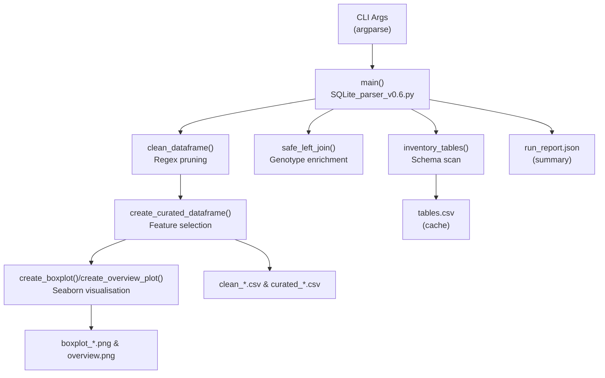

# CellProfiler SQLite Output Parser

Automated curation, enrichment, and visualization of CellProfiler `_Per_image` SQLite outputs.  

---

## Overview
The parser inventories every table in a CellProfiler SQLite database, optionally merges genotype annotations, converts area features into square micrometers, and generates curated CSV extracts alongside genotype-stratified box plots and overview dashboards for each `_Per_image` table.  

The latest workflow (**v0.6**) adds:  
- Replicate-aware overlays  
- Per-feature y-axis harmonisation  
- Cached CSV reuse  
- A JSON run report that captures parameters, join coverage, and generated artifacts  

Legacy scripts (v0.3, v0.5) remain for back-compatibility snapshots.  

---

## Key Features
- SQLite schema inventory with fast row counts and `_Per_image` table detection  
- Automated join-key discovery and coverage reporting for genotype enrichment  
- Area unit conversion, feature curation, and optional winsorization/outlier handling  
- Replicate-level overlays and global overview grids with shared y-axis scales  
- JSON run report + persisted CSV/PNG artifacts for reproducibility  

---

## Quickstart

### Prerequisites
- **Conda** (Miniconda/Anaconda)  
- **Python 3.10+**  
- Packages: `pandas`, `matplotlib`, `seaborn`, `sqlalchemy`, `argparse`, `json`, `logging`, `re`, `sys`, `pathlib`, `typing`, `datetime`  
- A CellProfiler-generated SQLite database file containing `_Per_image` tables  

### Installation
```bash
conda create -n cp-sqlite python=3.10 pandas seaborn matplotlib sqlalchemy
conda activate cp-sqlite
```

### Minimal Example
```bash
conda activate cp-sqlite
python SQLite_parser_v0.6.py   --db path/to/cellprofiler.sqlite   --join-table PlateMap   --plot-all   --winsorize   --equalize-y-limits   --outdir outputs
```

This inventories the database, enriches each `_Per_image` table with genotype information, generates curated CSVs, renders plots, and stores all results under `outputs/`.  

---

## Usage

### Command-Line Interface
| Flag | Description |
|------|-------------|
| `--db PATH` | Path to SQLite database (required) |
| `--table NAME` | Restrict to a single `_Per_image` table |
| `--plot-all` | Generate plots for all `_Per_image` tables |
| `--join-table NAME` | Load specified table for genotype enrichment |
| `--join-cols COL...` | Genotype column names to merge |
| `--join-keys KEY...` | Override built-in join-key order |
| `--regex-exclude PATTERN` | Drop matching columns before curation |
| `--features FEATURE... / --features-file FILE` | Feature whitelist |
| `--feature-labels LABEL... / --labels-file FILE` | Human-readable labels |
| `--winsorize` | Apply 1st–99th percentile clipping |
| `--limit N` | Limit number of rows retrieved |
| `--dry-run` | List tables without reading/writing data |
| `--force-refresh` | Ignore cached CSVs and re-read tables |
| `--outdir DIR` | Output directory for CSVs/plots/reports |
| `--example` | Print usage examples |
| `--strict-join / --min-coverage FLOAT` | Fail when joins fall below coverage |

---

## Data Flow
1. **Inventory** – Inspect schema, count rows → `tables.csv`  
2. **Filter** – Detect `_Per_image` tables  
3. **Enrich** – Merge genotype metadata, compute coverage stats  
4. **Extract** – Query tables, drop noisy cols, convert areas, emit CSVs  
5. **Plot** – Winsorize, overlay replicates, generate per-feature plots & dashboards  
6. **Report** – Write `run_report.json` summarising parameters + artifacts  

**Generated assets**:  
- `tables.csv`  
- `clean_{table}.csv`, `curated_{table}.csv`  
- `boxplot_{timepoint}_{feature}.png`, `overview_all_features_timepoints.png`  
- `run_report.json`  

---

## Library API (Function Reference)

### Well & Genotype Utilities
- `normalize_well(val, plate_size_hint=None)` → standardises well IDs  
- `discover_or_build_well(df)` → returns “Well” column  
- `detect_genotype_col(df)` → finds genotype column  
- `add_standard_keys(df)` → ensures `Well` & `Image_Metadata_Plate` exist  
- `is_unique(df, keys)` → checks uniqueness of keys  
- `safe_left_join(...)` → merges genotype data with coverage diagnostics  

### Metadata & Normalisation
- `_ddmmyy_to_iso(d)` → converts dates  
- `infer_metadata(df)` → extracts project/batch/date metadata  
- `winsorize(series, pct=1–99)` → percentile clipping  
- `convert_area_columns(df)` → converts areas to µm²  
- `order_genotypes(vals)` → consistent ordering  
- `prepare_plot_dataframe(df, feature, genotype_col)` → prep data for plots  
- `build_replicate_summary(...)` → per-well averages for overlays  

### Table Management
- `inventory_tables(engine)` → enumerate tables + row counts  
- `clean_dataframe(df, regex_exclude)` → drop excluded cols  
- `load_features_from_file(filepath)` → read features list  
- `create_curated_dataframe(df, features)` → apply curation & feature selection  

### Plotting
- `create_boxplot(...)` → seaborn genotype box plot, returns filename  
- `create_overview_plot(...)` → multi-feature overview grid  

### Entry Point
- `main()` → parses args, orchestrates workflow, logs summary  

---

## Architecture


---

## Development
- Create/activate Conda env  
- Use `--dry-run` to preview tables  
- Use `--limit` for fast prototyping  
- Use `--force-refresh` after DB updates  
- Use `--strict-join` + `--min-coverage` for metadata QC  
- **TODO:** Add automated tests & linting  

---

## Roadmap  
- **TODO:** Provide example SQLite DB + feature list + label list  

